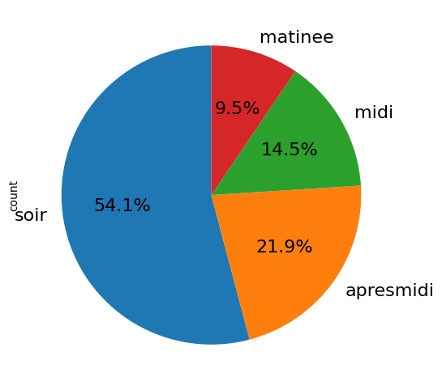
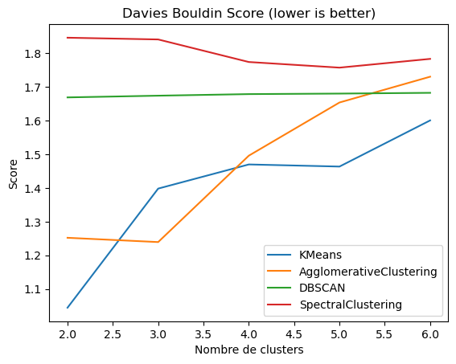

# What will you PIC ?

Projet de l'UV **IC05** de l'UTC (analyse critique des données numériques) : étudier les habitudes de consommation au **PIC'asso**, le foyer étudiant de l'UTC, à partir de ses données de caisse pseudo-anonymisées — obtenues avec l'accord du foyer — et construire dessus un algorithme de recommandation.

La démarche suit un pipeline data science complet : nettoyage et exploration, détection de profils de consommateurs, puis prédiction d'achat.

| | Contenu |
|---|---|
| **[Utilitaire](Utilitaire)** | Construction des jeux de données et analyse du dataset initial |
| **[Eda](Eda)** | Exploration : répartition des prix, des dates, tri des articles |
| **[Clustering](Clustering)** | Profils de consommateurs — KMeans, agglomératif, DBSCAN et spectral comparés |
| **[Classification](Classification)** | Prédiction d'achat : par article, par famille d'articles, puis en combinant les deux |
| **[Demonstration](Demonstration)** | Démonstration de la prédiction des familles d'articles |

## Un aperçu des résultats

  
  

Plus de la moitié des consommations ont lieu le soir ; côté clustering, KMeans obtient le meilleur score de Davies-Bouldin sur nos données. L'ensemble de la méthodologie et des résultats est détaillé dans le [rapport complet](Rapport.pdf) (25 pages).

Le dépôt ne contient **aucune donnée** : `data_original/` est volontairement vide, par respect des contraintes de confidentialité du projet.

## Collaborateurs

- [martincrz](https://github.com/martincrz)
- [sacha-sz](https://github.com/sacha-sz)
- [theodubus](https://github.com/theodubus)

## Licence

[MIT](LICENSE)
